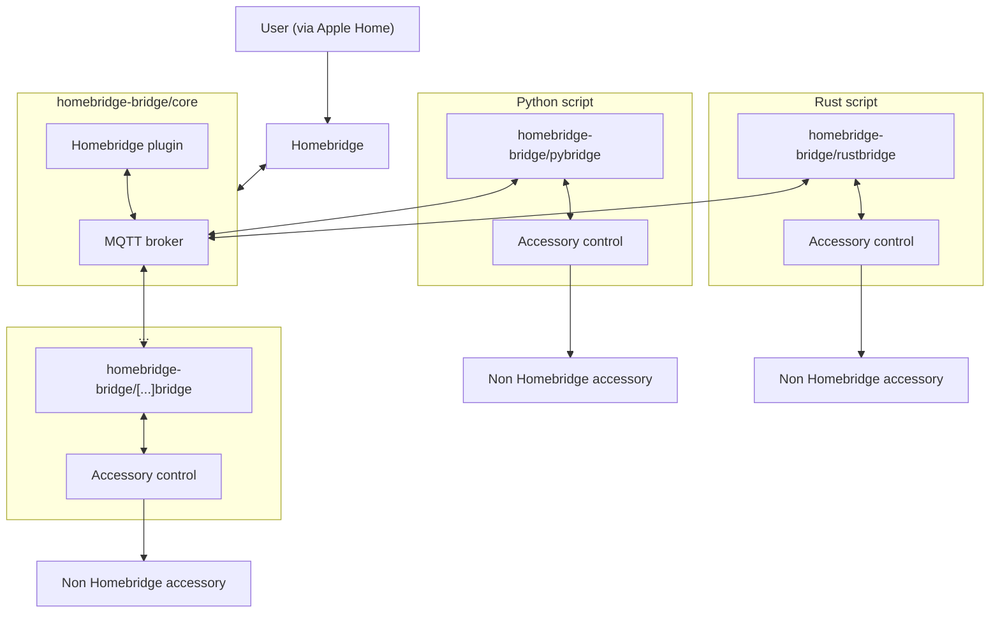

# Architecture

The architecture of this plugin and all subcomponents follows the so-called *Mediator* pattern.

The `homebridge-bridge` acts as a mediator between the supported programming language interfaces and Homebridge itself.
It forwards all accessory control requests coming from Homebridge as well as the logs coming from the programming language interfaces.

