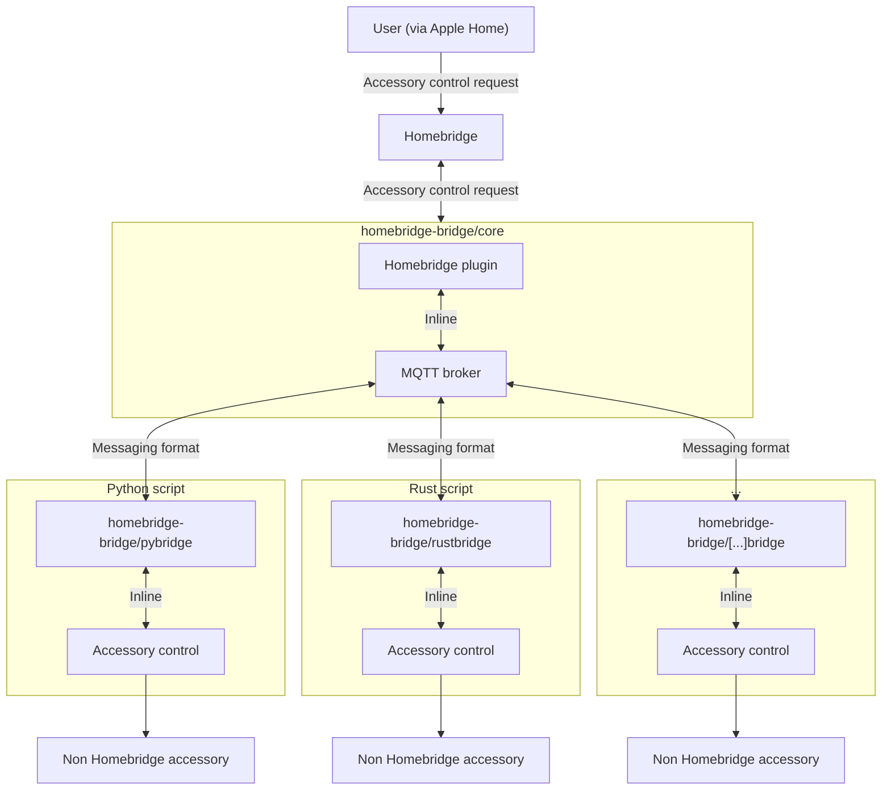

# Communication

To enable communication between multiple programming languages the MQTT protocol is used.

It handles two directions of message flow via a central MQTT broker integrated into this plugin.
All accessory control requests received by Homebridge will be published to the MQTT broker and thereby forwarded to **all** running programming language interfaces.
Furthermore, the programming language interfaces publish their logs to the MQTT broker, where they will be picked up and logged by `homebridge-bridge`.

## Topic structure

The MQTT topic structure is as follows:

- `accessory/<accessoryId>/request` - Accessory control requests
- `accessory/<accessoryId>/confirm` - Confirmations of accessory control requests

`accessoryId` is the name of the accessory as defined via Homebridge.
It must be unique across all configured accessories.

## Messaging format

Probably JSON, tbd.

## Architecture

